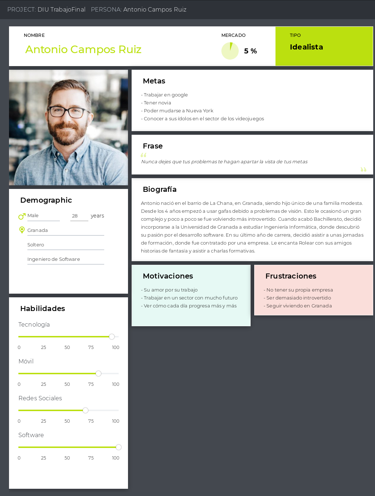
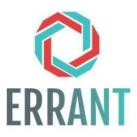
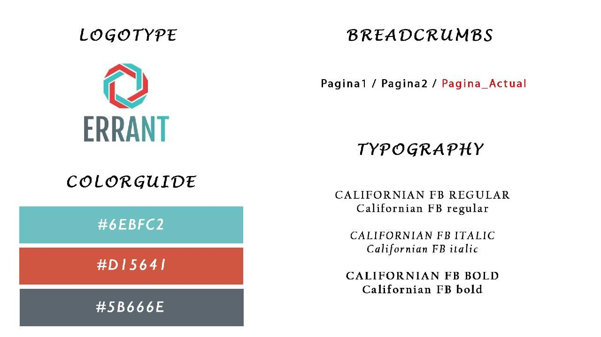

# DIU20 - Trabajo Final (3º Software)

- **Autor:** Miguel Muñoz Molina

- **Caso de estudio:** Este trabajo final ​INDIVIDUAL ​tiene como objetivo evaluar tu capacidad de aplicaciónde las técnicas y metodologías de diseño centrado en usuario y UX a un caso real: el ​(re)diseño de la web para una empresas de coworking ​(donde partimos de un diseño ya existente).

- **Descripción:** Para hacer este rediseño, he elegido la página ErranT porque considero que es la que más falta le hace y puedo comentar más cosas sobre ella. He decidido que voy a dividir el trabajo en varias fases, desde las primeras en las que analizaré la página, hasta las últimas en las que propondré un rediseño que mejore la página.

## Fase 1: Analicemos las páginas de Coworking

Lo primero de todo es preguntarse, ¿qué es el coworking?

La idea de coworking no sólo es que varias empresas y trabajadores autónomos compartan una oficina, sino que también existen personas encargadas de conectar a estos miembros entre sí, pudiendo originar nuevos contactos, amistades y oportunidades laborales.

Es por ello que vamos a echar un vistazo a las páginas ErranT y Cubikate, para ver qué tienen en común y qué le faltan.

## Fase 2: Análisis de la competencia

Primero voy a enumerar qué características tiene ErranT:

- Contratar tarifas de coworking
- Contactar con el soporte
- Consultar el blog
- Ofertar talleres
- Alquilar salas privadas
- Conocer coworkers

En su gran medida estas son las principales características de su página. Lo primero que vemos es que no tiene demasiadas funcionalidades en la propia página, por lo que probablemente se use algún otro tipo de canal de comunicación a la hora de convertirse en coworker.

Ahora voy a especificar qué otras funcionalidades añaden otras páginas de coworking que no añade ErranT:

- Solicitar visita
- Crear perfil
- Convertirse en partner
- Proporcionar formación

Hay algo que todas estas páginas tienen en común, y es su falta de funcionalidades, no mas allá de un escaparate para que reserves una plaza de coworker. En muchas de ellas ni siquiera existe un botón de inicio de sesión.

Me he decantado por ErranT porque incluye una funcionalidad realmente interesante, el mostrar un listado con todos sus coworkers y sus perfiles, algo realmente interesante para cualquiera que busque un espacio de coworking.

## Fase 3: Creación de una persona ficticia

Al no contar con ninguna persona que pueda contarme sus experiencias en esta página, voy a crear un perfil de persona que pueda estar interesado en ErranT para así buscar esos fallos de diseño que queremos pulir.

## Fase 4: Creación de un escenario para nuestra persona ficticia

El siguiente paso es someter a nuestro personaje a una experiencia que nos permita determinar algunos fallos de diseño.

Para ello, vamos a diseñar un escenario en el que hará uso de esta web.

- **Persona:** Antonio Campos Ruiz
- **Contexto:** Antonio quiere tener un lugar tranquilo en el que poder trabajar para su empresa actual, además de conocer gente de cara a futuros nuevos proyectos. No obstante, nunca ha usado ninguno de estos servicios de coworking.
- **Escenario:** Antonio entra a la página de ErranT y va al apartado de Coworking Granada. En esta página principal le resulta bastante anticuada la página, a parte que no logra encontrar las distintas redes sociales asociadas. Una vez dentro, ve un boton de reserva ya, pero no puede ver cuánto cuesta ni qué ofrece. Entonces, se da cuenta que si sigue mirando la página más hacia abajo le lleva a las distintas tarifas. Una vez seleccionada una, ve que no ha servido de nada ya que para reservarlo tiene que mandar un mensaje de contacto.
- **Conclusión:** Antonio es una persona experimentada con páginas web que puede darse cuenta de ciertos problemas casi sin darse cuenta. Es muy importante que las redes sociales se encuentran abajo de la página, a pesar de su importancia, y de que da igual qué tarifa selecciones ya que todas te llevan al mismo formulario de contacto.

## Fase 5: Creación de un Usability Review

He realizado un Usability Review de ErrantT,que podemos ver [aquí](/archivos/UsabilityReviewErranT.xls)

La nota obtenida es de **65**

Con este usability review hemos comprendido la falta de funcionalidades que tiene esta página y en qué cosas debe mejorar. Vemos que la nota es muy baja, ya que está acorde al poco trabajo en la página, incluso vemos partes que parecen hechas con prisa y están inacabadas. Es por ello que esta parte es muy importante para el rediseño de esta web.

## Fase 6: Descripción de los problemas encontrados

Lo primero que notamos es que la página de ErranT es como algo secundario, debido a que no cuenta con ninguna funcionalidad como tal. Es decir, parece una página en la que te muestran varias cosas pero no puedes interactuar con ella. Alguno de los problemas encontrados son:

- Las redes sociales están en la parte más baja de la página
- Hay problemas con el diseño de la página, imágenes de baja resolución, menús descentrados, mala colocación de algunos recursos.
- Añade un formulario de contacto en la propia página principal, en vez de añadirlo en un apartado del menú, para hacer la página más clara y sencilla.
- El reservar un espacio de coworking es un enlace al formulario de contacto, por lo tanto lo único que haces es informar de que quieres reservar, no puedes ni pagar ni crearte una cuenta.
- El cambiar de idioma hace que muchas partes de la página cambien, no ofreciendo la misma experiencia a usuarios de distinto idioma.
- Las noticias del blog no están centradas.

## Fase 7: Propuesta de nuevos Wireframes

Voy a proponer dos Wireframes, tanto para la página principal, como para la parte de convertirte en coworker, que creo que ayudarán a una página mucho mejor estructurada.

Este primer wireframe contiene la disposición más apropiada para la página web, llevando las redes sociales a un punto más importante, quitando esos espacios vacíos y eliminando el apartado de contacto, que ya se encuentra en su sección del menú.

Mi segunda propuesta es llevar más arriba las tarifas, y quitar esas fotos innecesarias que podemos encontrar en la página de ErranT. De esta forma, si entramos en las tarifas, será lo primero que veamos al entrar a la página, y ya más debajo lo apoyaremos con una galería de imágenes de las instalaciones.

## Fase 8: Añadir funcionalidades al sitemap

En esta fase voy a añadir varias cosas a la web de ErranT:

- Una página para registrarse y logearse, además de un perfil de usuario para poder añadirle una foto, tu trabajo actual, etc...
- Un sistema de pago para que se puedan reservar estos espacios desde la propia web, y no tener que acudir al contacto.
- Un chat (con un botón flotante en la parte inferior derecha) con el que poder contactar con otros usuarios, lo cual ayudaría bastante a los lazos que se puedan hacer entre ellos.
- Añadimos un apartado de Acerca De, para poder informarnos de la propia empresa y un poco de su trayectoria e historia, lo cual puede ser bastante importante.

## Fase 9: Modificación del logo y las guidelines

Creo que un problema que tiene ErranT es la falta de personalidad de su imagen. Considero que su logo es demasiado básico y sus colores son muy básicos y apagados.

Es por ello que voy a sugerir un nuevo logo mucho más moderno y unas guidelines más acorde a una página llena de gente activa con ganas de emprender, conocer gente, etc...

El logo sería el siguiente:

He utilizado un logo abstracto que está conformado por dos líneas que se entrelazan para así hacer alusión a la importancia de unir a las personas a través del coworking.

Para las guidelines he usado unos colores bastante trending y una tipografía bastante clara, además de hacer uso de los breadcrumbs para mejorar la página.

## Conclusión

En este trabajo hemos podido darnos cuenta de lo importante que es hacer un buen diseño para los usuarios, y como, lo que en un principio parece una buena página, puede esconder más fallos de los que esperamos.

Este ha sido un rediseño de tan sólo dos días, por lo que he tenido que prescindir de muchas herramientas, aunque creo que he hecho alusión a las más importantes y las que le proporcionarían un lavado de cara a la página.
